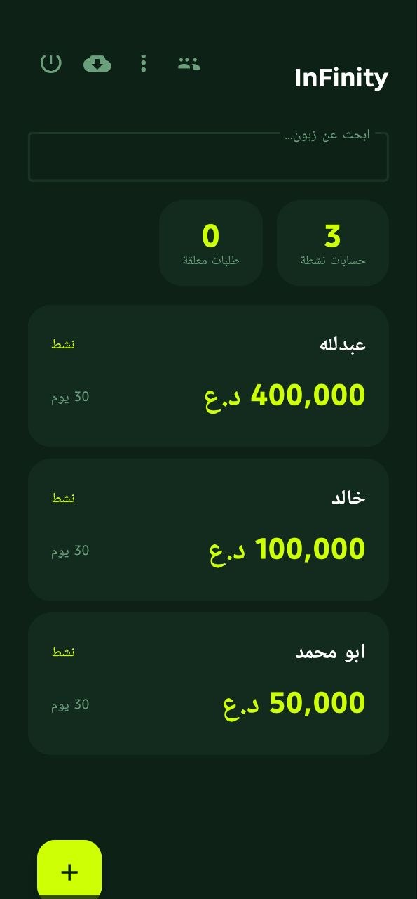
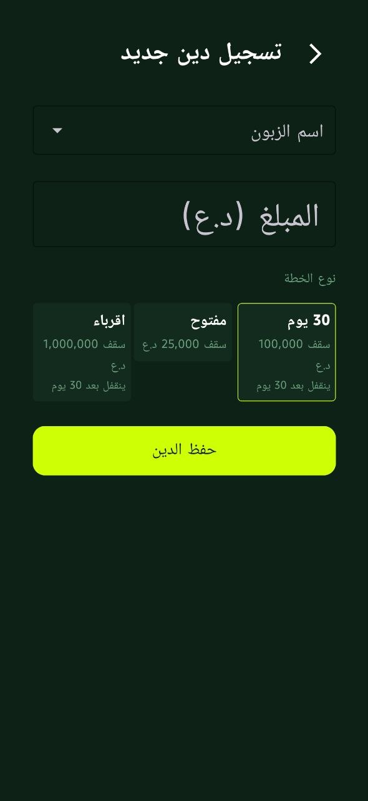
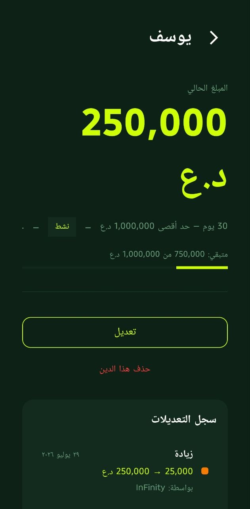

<p align="center">
  
</p>

<h1 align="center">سجل الديون</h1>
<p align="center"><b>Sajil al-Duyun — Debt Tracking App</b></p>

<p align="center">
  
  
  
  
  
</p>

---

## 📱 عن التطبيق

تطبيق **سجل الديون** هو تطبيق أندرويد لإدارة ديون الزبائن في **السوبرماركت العراقية**. يتيح التطبيق لأصحاب المتاجر والموظفين تسجيل الديون اليومية، متابعتها، وإدارة حسابات الزبائن بطريقة سهلة وآمنة.

### الميزات الرئيسية

- 👥 **نظام متعدد المستخدمين** — مالك + موظفين، مع صلاحيات مختلفة لكل دور
- 🔐 **بصمة الإصبع + كلمة مرور** — دخول آمن وسريع
- 📊 **تسجيل الديون** — إضافة ديون جديدة مع تحديد خطة السداد (30 يوم / مفتوح)
- ✅ **نظام الموافقات** — طلبات الموظفين تحتاج موافقة المالك
- 🔒 **قفل تلقائي** — عند تجاوز المدة أو السقف المحدد
- 💾 **نسخ احتياطي JSON** — تصدير واستيراد جميع البيانات
- 📄 **تقرير نصي** — تصدير تقرير للطباعة أو المشاركة
- ⏰ **تذكير يومي** — تذكير بالنسخ الاحتياطي كل صباح
- 📱 **بصمة الأصبع** — دعم بصمة الأصبع لتسجيل الدخول السريع

---

## 📱 About

**Sajil al-Duyun** is an Android app for tracking customer debts in **Iraqi supermarkets**. It enables store owners and workers to record daily debts, monitor them, and manage customer accounts easily and securely.

### Key Features

- 👥 **Multi-user system** — Owner + Workers with role-based permissions
- 🔐 **Fingerprint + PIN** — Secure and fast login
- 📊 **Debt recording** — Add new debts with plan selection (30-day / Unlimited)
- ✅ **Approval system** — Worker requests need owner approval
- 🔒 **Auto-lock** — When debt exceeds limit or days overdue
- 💾 **JSON backup** — Export and import all data
- 📄 **Text report** — Export printable/shareable reports
- ⏰ **Daily reminder** — Backup reminder every morning
- 📱 **Biometric auth** — Fingerprint support for quick login

---

## 🖼️ Screenshots

| | | |
|---|---|---|
|  |  |  |
|  | | |
---

## 🎨 التصميم والألوان

| اللون | الاستخدام | Hex |
|-------|-----------|------|
| أخضر غامق جداً | الخلفية الرئيسية | `#0D2117` |
| أصفر/ليموني | النصوص المميزة والأزرار | `#CFFF04` |
| أخضر متوسط | النصوص الثانوية | `#6B9E7A` |
| أحمر | الأخطاء والتنبيهات | `#FF4444` |
| برتقالي | التحذيرات | `#FF8C00` |

---

## 🛠️ التقنيات المستخدمة / Tech Stack

| التقنية | الاستخدام |
|---------|-----------|
| **Kotlin** | لغة التطوير |
| **Material Design 3** | واجهة المستخدم |
| **Room Database** | قاعدة البيانات المحلية |
| **AndroidX Biometric** | بصمة الأصبع |
| **WorkManager** | المهام المجدولة (النسخ الاحتياطي) |
| **FileProvider** | مشاركة الملفات |
| **RSA-2048** | تشفير تراخيص التطبيق |

---

## 🚀 Installation / التنصيب

### From Release (recommended)

1. Go to the [Releases page](https://github.com/InFinity0088/sajil-alduyun/releases)
2. Download the latest `app-debug.apk`
3. Open it on your Android device and install

> ⚠️ Enable **"Install from unknown sources"** in your device settings if prompted.

### Build from source

```bash
git clone https://github.com/InFinity0088/sajil-alduyun.git
cd sajil-alduyun
./gradlew assembleDebug
# APK will be at: app/build/outputs/apk/debug/app-debug.apk
```

---

## 📦 Backup / النسخ الاحتياطي

### Export JSON (long-press import button)
- Exports all debts, users, and history as a single `.json` file
- Share via any app (email, cloud, messaging)

### Import JSON (tap import button)
- Select a previously exported `.json` backup
- All data is restored to the database

### Export text report (old Drive button)
- Exports a human-readable `.txt` report
- Good for printing or sharing as a document

---

## 🔑 License System / نظام الترخيص

The app uses **RSA-2048** digital signatures for license verification:

```
python3 generate_code.py setup    # Owner setup code
python3 generate_code.py renew    # Renewal code
```

The license generator is at `~/Desktop/license_tools/` (local only — never committed).

---

## 👨‍💻 Developer

**InFinity0088**

<p align="center">
  
  <br>
  <sub>سجل الديون — Sajil al-Duyun © 2026</sub>
</p>
